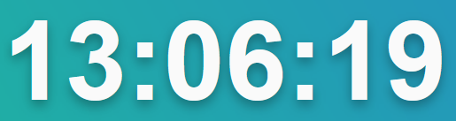
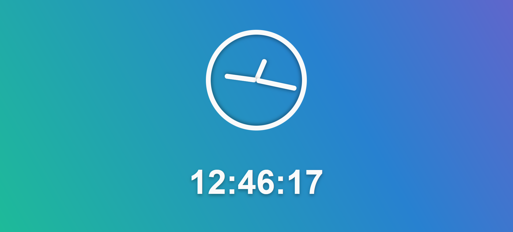

# JS Clock 🕑

A simple analogue and digital clock made using vanilla JavaScript

## Features ✨

- Analogue clock feature, with gradual hand movement and a notchless display
- 12-hour digital clock that goes form hours to minutes to seconds (00:00:00)
- Cool design inspired by Wes Bos' course, [JS30](https://javascript30.com/)
- An animated gradient background that subtly _changes_ as time goes on

## Installation & Usage 🛠️

1. Clone the repository using `git clone https://github.com/BeanyTheCoder/js-clock.git`.

2. Navigate to the project directory using `cd js-clock`.
3. Open the `index.html` file using any web browser of your choice.

## Screenshots 📷

### Analogue part

### Digital part

### Full screen clock

## Technologies Used 🛠️

- JavaScript
- HTML & CSS

## License 📝

This project is licensed under the [License Name](link-to-license-file).

## Acknowledgments 🙏

Inpiration from the 2nd episode of Wes Bos' course, [JS30](https://javascript30.com/)

## Contact 📧

For any questions or feedback, feel free to reach out to me at alexanderafoko@gmail.com.
